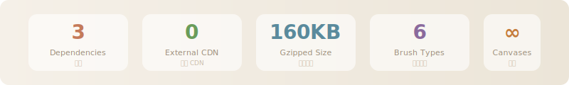
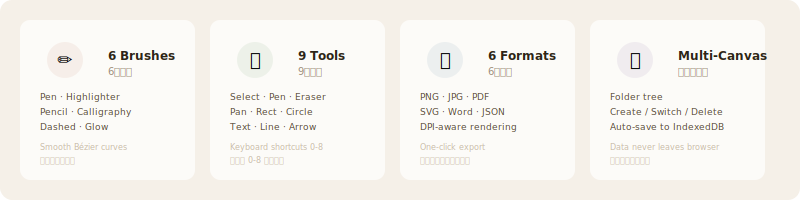

<div align="center">

<br />

<picture>
  <source media="(prefers-color-scheme: dark)" srcset="https://raw.githubusercontent.com/11suixing11/mindnotes-pro/main/.github/mindnotes-dark.svg">
  
</picture>

<br /><br />

<a href="https://11suixing11.github.io/mindnotes-pro/">
  
</a>
&nbsp;
<a href="https://github.com/11suixing11/mindnotes-pro/releases/latest">
  
</a>

<br /><br />

**English** | [中文](#中文)

<br />

**Open it. Draw. Close it. Your work is already saved.**
**打开就能画，关掉再打开，一切都在。**

<br />

[](https://github.com/11suixing11/mindnotes-pro/releases/latest)
[](LICENSE)


[](https://github.com/11suixing11/mindnotes-pro/actions)

<br /><br />



<br /><br />

</div>

---

<br />

## English

### What is it

A **canvas notebook**. Not a whiteboard tool. Not a knowledge base. A place where you can draw, write, and store — all on one canvas.

Left sidebar manages multiple canvases. Right canvas supports freehand drawing, text blocks, images, and shapes. Each canvas saves independently. Switch canvases, switch contexts.

### Why I built it

Every whiteboard app wanted me to sign up, sync to the cloud, and load 2MB of JavaScript.

I just wanted a canvas.

So I built MindNotes Pro — 3 dependencies, 0 CDNs, runs entirely locally.

### Features

<br />



<br />

| Category | Details |
|----------|---------|
| **Brushes** | Pen, Highlighter, Pencil, Calligraphy, Dashed, Glow |
| **Tools** | Select, Pen, Eraser, Pan, Rectangle, Circle, Text, Line, Arrow |
| **Elements** | Strokes, Shapes, Text blocks (drag/resize/edit), Images |
| **Export** | PNG, JPG, PDF, SVG, Word, JSON |
| **Canvas** | Infinite canvas, zoom, minimap, custom background |
| **Storage** | IndexedDB, auto-save (1.5s debounce), multi-canvas |
| **UX** | Dark mode, touch support, keyboard shortcuts, fullscreen |

### Quick Start

**Online** → [https://11suixing11.github.io/mindnotes-pro/](https://11suixing11.github.io/mindnotes-pro/)

**Offline** → Download zip from [Releases](https://github.com/11suixing11/mindnotes-pro/releases/latest), extract, open `index.html`

**From source:**

```bash
git clone https://github.com/11suixing11/mindnotes-pro.git
cd mindnotes-pro
npm install
npm run dev
```

### Keyboard Shortcuts

| `0` Select | `1` Pen | `2` Eraser | `3` Pan | `4` Rect | `5` Circle | `6` Text | `7` Line | `8` Arrow |
|:---:|:---:|:---:|:---:|:---:|:---:|:---:|:---:|:---:|

| `Ctrl+Z` Undo | `Ctrl+Shift+Z` Redo | `+/-` Zoom | `Scroll` Wheel zoom | `Del` Delete selected |
|:---:|:---:|:---:|:---:|:---:|

### Tech Stack

```
React 18  ·  TypeScript 5  ·  Vite 5  ·  Zustand  ·  Canvas API
```

**3 production dependencies**: `react`, `react-dom`, `zustand`

<br />


<br />

### Design Philosophy

> Good design is restrained expression, warm thinking.

| Principle | Practice |
|-----------|----------|
| **Breathing** | Generous whitespace, less decoration |
| **Restraint** | 3 deps, 0 CDN, unified rules |
| **Texture** | SVG noise paper, glass morphism, soft shadows |
| **Warmth** | Parchment `#f5f0e8`, burnt umber `#c47a5a`, 14px radius |
| **Order** | 42px tool buttons, 8px gaps, consistent animations |
| **Hierarchy** | Primary actions stand out, secondary recede |

### Browser Support

| Chrome / Edge 90+ | Firefox 90+ | Safari 15+ | Mobile |
|:---:|:---:|:---:|:---:|
| ✅ | ✅ | ✅ | ✅ Touch |

<br />

---

<br />

<a id="中文"></a>

## 中文

### 这是什么

一个**画布笔记本**。不是白板工具，不是知识库，是能画能写的笔记本。

左侧边栏管理多个画布，右侧画布上自由绘图、书写、插入图片、放置文本块。每个画布独立保存，切换即切换。

### 为什么做这个

每个白板应用都想让我注册账号、同步到云端、加载 2MB 的 JavaScript。

我只是想要一块画布。

所以做了 MindNotes Pro — 3 个依赖，0 个 CDN，纯本地运行。

### 功能

<br />


<br />

| 类别 | 详情 |
|------|------|
| **笔刷** | 钢笔、荧光笔、铅笔、书法笔、虚线笔、霓虹笔 |
| **工具** | 选择、画笔、橡皮、平移、矩形、圆形、文字、直线、箭头 |
| **元素** | 笔迹、形状、文本块（可拖拽/缩放/编辑）、图片 |
| **导出** | PNG、JPG、PDF、SVG、Word、JSON |
| **画布** | 无限画布、缩放、小地图、自定义背景 |
| **存储** | IndexedDB、自动保存（1.5秒防抖）、多画布管理 |
| **体验** | 暗色模式、触屏支持、快捷键、全屏 |

### 快速开始

**在线使用** → [https://11suixing11.github.io/mindnotes-pro/](https://11suixing11.github.io/mindnotes-pro/)

**下载离线版** → 从 [Releases](https://github.com/11suixing11/mindnotes-pro/releases/latest) 下载 zip，解压后双击 `index.html`

**从源码运行：**

```bash
git clone https://github.com/11suixing11/mindnotes-pro.git
cd mindnotes-pro
npm install
npm run dev
```

### 快捷键

| `0` 选择 | `1` 画笔 | `2` 橡皮 | `3` 平移 | `4` 矩形 | `5` 圆形 | `6` 文字 | `7` 直线 | `8` 箭头 |
|:---:|:---:|:---:|:---:|:---:|:---:|:---:|:---:|:---:|

| `Ctrl+Z` 撤销 | `Ctrl+Shift+Z` 重做 | `+/-` 缩放 | `Scroll` 滚轮缩放 | `Del` 删除选中 |
|:---:|:---:|:---:|:---:|:---:|

### 技术栈

```
React 18  ·  TypeScript 5  ·  Vite 5  ·  Zustand  ·  Canvas API
```

**3 个生产依赖**：`react`、`react-dom`、`zustand`

<br />


<br />

### 设计哲学

> 好设计，是克制的表达，也是有温度的思考。

| 原则 | 实践 |
|------|------|
| **呼吸感** | 大间距，少装饰，留白即信息 |
| **克制** | 3 个依赖，0 个 CDN，统一规则 |
| **质感** | SVG 噪点纸纹，毛玻璃面板，柔阴影 |
| **温度** | 暖色 `#f5f0e8` + 焦赭 `#c47a5a`，圆角 14px |
| **秩序** | 42px 工具按钮，8px 间距，统一动画曲线 |
| **层次** | 主操作突出，次操作退后，信息等级清晰 |

### 浏览器支持

| Chrome / Edge 90+ | Firefox 90+ | Safari 15+ | 移动端 |
|:---:|:---:|:---:|:---:|
| ✅ | ✅ | ✅ | ✅ 触屏绘图 |

<br />

---

<br />

<div align="center">

**用心做的东西，自己会跑。**

**The best tools are the ones you actually use.**

<br />

<a href="https://11suixing11.github.io/mindnotes-pro/">在线使用 Launch</a>
&nbsp;·&nbsp;
<a href="https://github.com/11suixing11/mindnotes-pro/releases">下载 Download</a>
&nbsp;·&nbsp;
<a href="https://github.com/11suixing11/mindnotes-pro/issues">反馈 Issues</a>

<br /><br />

</div>
