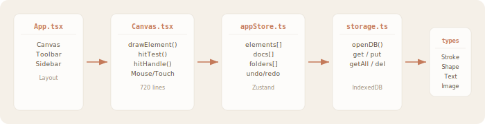

<div align="center">

<br />


<br /><br />

# 一个打开就能画的笔记本

### A canvas notebook that just works. Open. Draw. Close. Done.

<br />

<a href="https://11suixing11.github.io/mindnotes-pro/">
  
</a>
&nbsp;
<a href="https://github.com/11suixing11/mindnotes-pro/releases/latest">
  
</a>

<br /><br />

不注册 · 不联网 · 不打扰 · 数据只在你的浏览器里

<br />

[](https://github.com/11suixing11/mindnotes-pro/releases/latest)
[](LICENSE)
[](https://github.com/11suixing11/mindnotes-pro/actions)

<br /><br />

</div>

---

<br />

## 为什么做这个

> 每个白板应用都想让我注册、同步、加载 2MB 的 JavaScript。
>
> 我只是想要一块画布。

所以做了 MindNotes Pro。

**不注册。** 打开就用。\
**不联网。** 零外部 CDN，国内直接访问。\
**不打扰。** 自动保存，关掉再打开，一切都在。

<br />

## 能做什么

<br />

| | 功能 | 详情 |
|:---:|:-----|:-----|
| ✏️ | **6 种笔刷** | 钢笔、荧光笔、铅笔、书法笔、虚线笔、霓虹笔 |
| 🔧 | **9 种工具** | 选择、画笔、橡皮、平移、矩形、圆形、文字、直线、箭头 |
| 📝 | **文本块** | 画布上直接打字，可拖拽、缩放、双击编辑 |
| 📷 | **图片插入** | 本地图片直接拖入画布 |
| 🔍 | **选中缩放** | 拖动四角控制点缩放任意元素 |
| 📁 | **多画布** | 侧栏文件夹管理，创建/切换/删除画布 |
| 💾 | **6 种导出** | PNG、JPG、PDF、SVG、Word、JSON |
| 🌙 | **暗色模式** | 一键切换，跟随系统 |
| ⌨️ | **快捷键** | 0-8 切换工具，Ctrl+Z 撤销，滚轮缩放 |

<br />

## 跟别的白板有什么不同

<br />

| | MindNotes Pro | Excalidraw | tldraw | Jamboard |
|:---|:---:|:---:|:---:|:---:|
| **需要注册** | ❌ 不需要 | ❌ | ❌ | ✅ 需要 Google |
| **离线使用** | ✅ 完全离线 | ⚠️ 部分 | ⚠️ 部分 | ❌ |
| **外部 CDN** | 0 个 | 多个 | 多个 | 多个 |
| **中国可访问** | ✅ 直接打开 | ⚠️ 需要代理 | ⚠️ 需要代理 | ❌ |
| **数据存储** | 本地 IndexedDB | 本地 + 云端 | 本地 + 云端 | Google 云端 |
| **文本块** | ✅ 画布内编辑 | ⚠️ 基础 | ✅ | ⚠️ 基础 |
| **多画布管理** | ✅ 文件夹 | ❌ | ❌ | ✅ |
| **笔刷种类** | 6 种 | 1 种 | 1 种 | 1 种 |
| **暖色纸纹设计** | ✅ | ❌ | ❌ | ❌ |
| **开源** | ✅ MIT | ✅ | ✅ | ❌ |

<br />

## 快速开始

<br />

**在线使用：** [https://11suixing11.github.io/mindnotes-pro/](https://11suixing11.github.io/mindnotes-pro/)

**下载离线版：** [Releases](https://github.com/11suixing11/mindnotes-pro/releases/latest) 下载 zip，解压后双击 `index.html`

**从源码运行：**

```bash
git clone https://github.com/11suixing11/mindnotes-pro.git
cd mindnotes-pro
npm install
npm run dev
```

<br />

## 快捷键

<br />

| `0` 选择 | `1` 画笔 | `2` 橡皮 | `3` 平移 | `4` 矩形 | `5` 圆形 | `6` 文字 | `7` 直线 | `8` 箭头 |
|:---:|:---:|:---:|:---:|:---:|:---:|:---:|:---:|:---:|

| `Ctrl+Z` 撤销 | `Ctrl+Shift+Z` 重做 | `+/-` 缩放 | `Scroll` 滚轮缩放 | `Del` 删除选中 |
|:---:|:---:|:---:|:---:|:---:|

<br />

## 技术栈

<br />

```
React 18  ·  TypeScript 5  ·  Vite 5  ·  Zustand  ·  Canvas API
```

**3 个生产依赖**：`react`、`react-dom`、`zustand`

<br />



<br />

## 设计哲学

<br />

> 好设计，是克制的表达，也是有温度的思考。

| 原则 | 实践 |
|:-----|:-----|
| **呼吸感** | 大间距，少装饰，留白即信息 |
| **克制** | 3 个依赖，0 个 CDN，统一规则 |
| **质感** | SVG 噪点纸纹，毛玻璃面板，柔阴影 |
| **温度** | 暖色 `#f5f0e8` + 焦赭 `#c47a5a`，圆角 14px |
| **秩序** | 42px 工具按钮，8px 间距，统一动画曲线 |

<br />

---

<br />

<div align="center">

**用心做的东西，自己会跑。**

<br />

如果你觉得有用，点个 ⭐ 鼓励一下。

<br />

<a href="https://11suixing11.github.io/mindnotes-pro/">在线使用</a>
&nbsp;·&nbsp;
<a href="https://github.com/11suixing11/mindnotes-pro/releases">下载</a>
&nbsp;·&nbsp;
<a href="https://github.com/11suixing11/mindnotes-pro/issues">反馈</a>

<br /><br />

</div>
