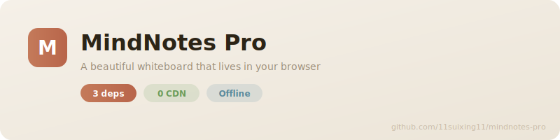
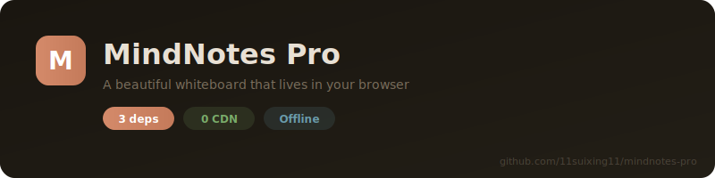

<div align="center">


# MindNotes Pro

**全球首款搭载物理擦除引擎的白板应用。**  
一款漂亮的本地白板画图应用，用起来像在纸上画画一样自然。

不联网、不追踪、不收费。打开就画。

<p>
  <a href="https://11suixing11.github.io/mindnotes-pro"></a>
  &nbsp;
  <a href="#快速开始"></a>
</p>

<p>
  <a href="https://github.com/11suixing11/mindnotes-pro/actions/workflows/ci.yml"></a>
  <a href="https://github.com/11suixing11/mindnotes-pro/stargazers"></a>
  <a href="https://github.com/11suixing11/mindnotes-pro/network/members"></a>
  
  <a href="LICENSE"></a>
  
  
  
</p>

<p>
  <strong>🌐 语言：</strong>
  <a href="README.md">English</a> ·
  <strong>中文</strong> ·
  <a href="README_JA.md">日本語</a>
</p>
</div>

---

## 🏆 史上最真实的擦除体验

<div align="center">
  
</div>

> **为什么它和其他所有白板都不一样？**
>
> 每个白板都有橡皮擦。**但没有一个有物理引擎。**
>
> ✨ **压力感应** —— 用力擦得干净，轻擦变淡
> ✨ **磨损模拟** —— 橡皮越用越钝，就像真实生活一样
> ✨ **形状感知** —— 圆形、方形、凿形，三种橡皮各有不同
> ✨ **倾斜支持** —— Apple Pencil 侧擦，就像真的铅笔一样
> ✨ **粒子效果** —— 看着橡皮屑飞散
> ✨ **音效反馈** —— 听到擦除的沙沙声，音量随压力变化
> ✨ **3种橡皮预设** —— 2B硬橡皮、4B中性、6B软橡皮

这不是简单的"删除笔触"。这是**真正的擦除**。

---

## ✨ 核心亮点

> **为什么开发者和设计师都在转向 MindNotes Pro：**
>
> - 🎯 **全球首创物理擦除引擎** —— 22轮优化，业界领先的真实感
> - 🪶 **仅 5 个运行时依赖** —— 没有依赖地狱，没有供应链焦虑
> - ⚡ **不到 1 秒加载** —— 比你的咖啡机还快
> - 📲 **离线 PWA** —— 飞机上、隧道里、任何地方都能用
> - 🔒 **零云端依赖** —— 你的数据永远不会离开你的设备
> - 🎨 **莫奈印象派美学** —— 水彩调色板、毛玻璃、纸张纹理

```bash
git clone https://github.com/11suixing11/mindnotes-pro && cd mindnotes-pro && npm i && npm run dev
```

---

## 为什么你会爱上它

<table>
<tr>
<td width="50%">

### 🎯 物理擦除引擎 —— 业界独家

**这一个功能就经过了 22 轮优化：**

- **压力感应** —— 重压擦除干净，轻压笔触变淡
- **磨损模拟** —— 橡皮越用越钝，像削铅笔一样"削橡皮"
- **3种橡皮形状** —— 圆形、方形、凿形，支持旋转
- **Apple Pencil 倾斜** —— 侧擦效果，就像真实的美术橡皮
- **橡皮屑粒子** —— 看着它们飞散然后消失
- **动态音效** —— 声音随压力、速度、磨损变化
- **3种美术橡皮预设** —— 2B / 4B / 6B 硬度等级
- **完整键盘快捷键** —— 专业级效率

### 🎨 像画画，不像用软件

灵感来自**莫奈的印象派调色板** —— 水彩渐变背景、毛玻璃面板、纸张纹理，让数字绘画温暖而有人情味。六种独特笔刷：钢笔、荧光笔、铅笔、书法笔、虚线笔、彩虹发光笔。

### 🔒 你的想法只属于你

**所有数据都在浏览器里。** 不需要注册账号，没有服务器，没有"登录后保存"。数据永远不会离开你的设备 —— 甚至可以作为 PWA 离线使用。

### ⚡ 零臃肿，秒加载

只有 **5 个运行时依赖**。不到一秒加载完成。不是 50MB 的 Electron 应用，没有加载转圈 —— 一个随时待命的白板。

</td>
<td width="50%">

### 📝 可视化思考

- ✏️ 手绘笔触，**6 种笔刷风格**
- 🧽 **物理擦除引擎** —— 所有白板中最真实的擦除体验
- 🔷 图形工具 —— 矩形、圆形、线条、箭头
- 📝 内联文字注释
- 🖼️ 直接粘贴图片到画布
- 🖱️ 框选、缩放、移动、吸附对齐
- ↩️ 完整的撤销/重做历史
- 🌙 暗色模式（自动跟随系统）
- 📄 导出为 **PDF** 或 **PNG**

### 🗂️ 井井有条

- 多文档工作区
- 文件夹层级管理
- 自动保存到 localStorage
- 重命名、复制、删除 —— 全部本地完成
- 用户偏好跨会话记住

### ⌨️ 专业快捷键

在应用中按 `?` 查看全部。橡皮擦专用快捷键：

- `1`/`2`/`3` —— 切换橡皮形状
- `Q`/`W`/`E` —— 切换橡皮预设（2B/4B/6B）
- `R` —— 削橡皮
- `M` —— 开关擦除音效
- `[` / `]` —— 调整橡皮大小

</td>
</tr>
</table>

---

## 谁适合用？

| 你是...                 | MindNotes Pro 帮你...              |
| ----------------------- | ---------------------------------- |
| 🎨 **艺术家 / 手绘爱好者** | 体验目前最真实的数字擦除效果       |
| 🎓 **学生**             | 上课时快速画图、标注知识点         |
| 💡 **设计师**           | 不开 Figma 也能快速草拟方案        |
| 👩‍💻 **开发者**           | 白板上画系统架构和流程图           |
| 📋 **笔记爱好者**       | 在同一块画布上混合手写、图形和文字 |
| 🧠 任何**视觉化思考者** | 把脑子里的想法倒到画布上 —— 立刻   |

---

## 截图

<div align="center">
  <table>
    <tr>
      <td align="center"><strong>☀️ 亮色模式</strong></td>
      <td align="center"><strong>🌙 暗色模式</strong></td>
    </tr>
    <tr>
      <td></td>
      <td></td>
    </tr>
  </table>
</div>

---

## 竞品对比

**物理擦除让我们与众不同 —— 没有其他人有这个！**

|                | MindNotes Pro 🏆 | Excalidraw | tldraw  | Drawnix | Miro |
| -------------- | :--------------: | :--------: | :-----: | :-----: | :--: |
| **物理擦除引擎** |    ✅ **有**    |     ❌     |   ❌    |   ❌    |  ❌  |
| **压力感应**   |    ✅ **有**    |     ❌     |   ❌    |   ❌    |  ❌  |
| **磨损模拟**   |    ✅ **有**    |     ❌     |   ❌    |   ❌    |  ❌  |
| **橡皮屑粒子** |    ✅ **有**    |     ❌     |   ❌    |   ❌    |  ❌  |
| **音效反馈**   |    ✅ **有**    |     ❌     |   ❌    |   ❌    |  ❌  |
| **开源**       |    ✅ MIT     |   ✅ MIT   | ⚠️ 部分 | ✅ MIT  |  ❌  |
| **本地优先**   |      ✅       |     ❌     |   ❌    |   ❌    |  ❌  |
| **运行时依赖** |     **5**     |    30+     |   50+   |   20+   | N/A  |
| **包体积**     |   **< 200 KB**  |   ~2 MB    |  ~3 MB  | ~1.5 MB | N/A  |
| **加载时间**   |   **< 1秒** ⚡  |   3-5秒    |  3-5秒  |  2-4秒  | 5秒+ |
| **离线 PWA**   |      ✅       |     ⚠️     |   ❌    |   ❌    |  ❌  |
| **自定义美学** |   ✅ 莫奈风   | ✅ 手绘风  | ⚠️ 基础 | ✅ 简洁 |  ✅  |
| **遥测/追踪**  |    ✅ **无**   |    ⚠️ 有   |  ⚠️ 有  | ✅ 无   | ✅ 多 |
| **永久免费**   |      ✅       |     ✅     |   ⚠️    |   ✅    |  ❌  |

---

## 快捷键

在应用中按 `?` 查看全部快捷键。常用快捷键：

| 快捷键                | 功能                      |
| --------------------- | ------------------------- |
| `P`                   | 画笔                      |
| `E`                   | 橡皮擦（物理模式）        |
| `S`                   | 选择工具                  |
| `T`                   | 文字工具                  |
| `R` / `C` / `L` / `A` | 矩形 / 圆形 / 线条 / 箭头 |
| `Space` + 拖拽        | 平移画布                  |
| `Ctrl` + `Z` / `Y`    | 撤销 / 重做               |
| `Ctrl` + `A`          | 全选                      |
| `Ctrl` + `C` / `V`    | 复制 / 粘贴               |
| `Ctrl` + `E`          | 导出菜单                  |
| `Delete`              | 删除选中                  |
| `滚轮`                | 缩放                      |
| `Dark/Light`          | 切换主题                  |

**橡皮擦专用快捷键：**

| 快捷键                | 功能                      |
| --------------------- | ------------------------- |
| `1` / `2` / `3`       | 切换橡皮形状              |
| `Q` / `W` / `E`       | 切换橡皮预设（2B/4B/6B）  |
| `R`                   | 削橡皮（重置磨损）        |
| `M`                   | 开关擦除音效              |
| `[` / `]`             | 调整橡皮大小              |

---

## 快速开始

### 直接打开

👉 **[打开 MindNotes Pro](https://11suixing11.github.io/mindnotes-pro)** —— 无需安装，无需注册。**试试物理擦除！**

### 本地运行

```bash
git clone https://github.com/11suixing11/mindnotes-pro.git
cd mindnotes-pro
npm install
npm run dev
```

打开 [http://localhost:3000](http://localhost:3000) —— 30 秒内开始画画。

### 部署你自己的

<p>
  <a href="https://vercel.com/new/clone?repository-url=https://github.com/11suixing11/mindnotes-pro">
    
  </a>
  &nbsp;
  <a href="https://app.netlify.com/start/deploy?repository=https://github.com/11suixing11/mindnotes-pro">
    
  </a>
</p>

---

## 💬 用户怎么说

> _"物理擦除太离谱了。我之前不知道我需要这个，试过之后回不去普通橡皮擦了。"_
> — ⭐ 早期用户

> _"终于有一个 < 200KB 的白板应用了。我的学生们超爱用它画示意图。"_
> — ⭐ 教育工作者

> _"莫奈配色太好看了。我从 Excalidraw 转过来做快速草图。"_
> — ⭐ 设计师

> _"擦除现在居然有爽感了。那个粒子效果绝了。"_
> — ⭐ 艺术家

**你在用 MindNotes Pro 吗？** [分享你的使用体验](https://github.com/11suixing11/mindnotes-pro/discussions/showcase) —— 我们很想听听你的想法！

---

## 技术栈

| 层级 | 选型                                  | 原因                    |
| ---- | ------------------------------------- | ----------------------- |
| UI   | React 18 + TypeScript                 | 类型安全、高性能        |
| 状态 | Zustand（6 个 slice）                 | 极小、无样板代码        |
| 绘图 | perfect-freehand + Canvas API         | 自然笔触                |
| **擦除** | **自研物理引擎 + RBush** | **业界独家**        |
| 样式 | Tailwind CSS + 莫奈配色               | 默认就很美              |
| 导出 | jsPDF（懒加载）                       | 不影响首屏加载          |
| 构建 | Vite 5                                | 即时 HMR                |
| 测试 | Vitest + Testing Library              | 574+ 单元测试           |

---

## 🗺️ 路线图

| 版本 | 功能                                                                | 状态        |
| ---- | ------------------------------------------------------------------- | ----------- |
| v3.3 | 🧽 **物理擦除引擎** —— 完成！22轮优化全部交付                       | ✅ **已发布** |
| v3.4 | 🎨 **橡皮品牌皮肤** —— 樱花、辉柏嘉等                               | 📋 规划中    |
| v3.4 | ⌨️ **快捷键自定义** —— 重新映射任何快捷键                           | 📋 规划中    |
| v4.0 | 🤝 **实时协作** —— 在同一块画布上一起画                             | 🔄 规划中    |
| v4.0 | 🔌 **插件系统** —— 扩展自定义笔刷、形状和导出                       | 🔄 规划中    |
| v4.0 | 📱 **移动端优化** —— 触摸手势、响应式工具栏                         | 🔄 规划中    |

> 对路线图有想法？[发起讨论](https://github.com/11suixing11/mindnotes-pro/discussions) 告诉我们！

---

## 🤝 参与贡献

**欢迎所有人。** 无论你是资深开源贡献者还是第一次提交 PR —— 我们都欢迎你的帮助。没有太小的贡献：修复一个拼写错误、改进文档、或者提交一个功能。

- 🐛 **发现了 Bug？** → [提交 Issue](https://github.com/11suixing11/mindnotes-pro/issues/new?template=bug_report.yml)
- 💡 **有好点子？** → [请求功能](https://github.com/11suixing11/mindnotes-pro/issues/new?template=feature_request.yml)
- 🔧 **想写代码？** → 阅读 [CONTRIBUTING.md](CONTRIBUTING.md) —— 5分钟就能上手
- ⭐ **喜欢这个项目？** → 给个 Star —— 这真的能帮助更多人发现它

### 新手友好的 Issue 🌱

第一次参与开源？我们为新手精选了一些 issue：

👉 **[浏览所有 Good First Issues](https://github.com/11suixing11/mindnotes-pro/labels/good%20first%20issue)**

---

## 💚 支持项目

如果 MindNotes Pro 对你有用，这里有一些方式可以帮助项目成长：

| 动作                       | 影响                                                                                                                |
| -------------------------- | ------------------------------------------------------------------------------------------------------------------- |
| ⭐ **给仓库点 Star**        | 帮助更多人发现这个项目 —— **这是你能做的最重要的事**                                                                 |
| 🐦 **在社交媒体分享**      | 发微博、发小红书、在团队群里分享物理擦除的神奇体验                                                                   |
| 🍴 **Fork 并定制**          | 改成你喜欢的样子，然后分享回社区                                                                                    |
| 🐛 **报告 Bug**             | [提交 Issue](https://github.com/11suixing11/mindnotes-pro/issues/new) —— 哪怕一句话都有帮助                           |
| 💬 **加入讨论**             | [GitHub Discussions](https://github.com/11suixing11/mindnotes-pro/discussions) —— 想法、问题、展示你的作品           |
| 🔧 **贡献代码**             | 查看 [CONTRIBUTING.md](CONTRIBUTING.md) 开始                                                                        |

---

## Star 历史

<div align="center">
  <a href="https://star-history.com/#11suixing11/mindnotes-pro&Date">
    <picture>
      <source media="(prefers-color-scheme: dark)" srcset="https://api.star-history.com/svg?repos=11suixing11/mindnotes-pro&type=Date&theme=dark" />
      <source media="(prefers-color-scheme: light)" srcset="https://api.star-history.com/svg?repos=11suixing11/mindnotes-pro&type=Date" />
      
    </picture>
  </a>
</div>

---

## 许可证

[MIT](LICENSE) —— 随便用。

---

<div align="center">
**由 [11suixing11](https://github.com/11suixing11) 用 ❤️ 构建**

<sub>如果 MindNotes Pro 让你免于为了一个简单草图而打开 Figma —— 给它一个 ⭐</sub>

<sub>**物理擦除引擎经过了 22 轮优化。如果你喜欢它，告诉身边的朋友！**</sub>
</div>
