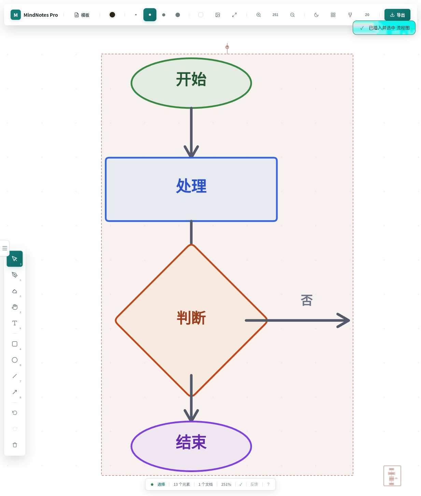

<div align="center">
  
  <h1>MindNotes Pro</h1>
  <p><strong>描画、編集可能なテンプレート、持ち運べるエクスポートのためのローカルファースト・ホワイトボード。</strong></p>
  <p>アカウント、クラウドワークスペース、描画内容の分析はありません。開いてすぐに描けます。</p>
  <p>
    <a href="https://11suixing11.github.io/mindnotes-pro"><strong>Web アプリを開く</strong></a>
    ·
    <a href="README.md">English</a>
    ·
    <a href="README_CN.md">中文</a>
  </p>
  <p>
    <a href="https://github.com/11suixing11/mindnotes-pro/actions/workflows/ci.yml"></a>
    
    <a href="LICENSE"></a>
    
  </p>
</div>

<p align="center">
  
</p>

## v4 でできること

MindNotes Pro は空のキャンバスから始まり、すぐに操作できます。v4 はデモ機能を増やすのではなく、基本的な作業を最後まで完了できることを重視しています。

| 領域           | 現在の動作                                                                               |
| -------------- | ---------------------------------------------------------------------------------------- |
| 描画           | 複数のブラシ、筆圧ストローク、四角形、円、線、矢印、テキスト、画像                       |
| 編集           | 選択、移動、リサイズ、回転、グループ化、ロック、コピー、取り消し、やり直し、部分消去     |
| ワークスペース | 複数ドキュメント、検索、並べ替え、レイヤー、背景、グリッド、スナップ、ズーム、ミニマップ |
| テンプレート   | 5 個の組み込みテンプレートと、キャンバスから作成するカスタムテンプレート                 |
| 保存           | IndexedDB への自動保存。設定とカスタムテンプレートも端末内に保存                         |
| 入出力         | 全内容の PNG、JPEG、PDF、SVG。v4 JSON バックアップと v4、v3、旧形式のインポート          |
| 実行環境       | レスポンシブ Web、オフライン PWA、サンドボックス化された Electron シェル                 |

## ローカルファーストの範囲

- ドキュメントはブラウザーの IndexedDB `mindnotes-pro-v4` に保存されます。
- アカウント、ホスト型同期、リアルタイム共同編集は提供しません。
- サイトデータを消去するとドキュメントも失われる場合があります。重要な作業は JSON でバックアップしてください。
- JSON のインポートは現在のドキュメントを上書きせず、別の編集可能なドキュメントを作成します。

## クイックスタート

必要環境: Node.js `>=22.22.2` と npm。

```bash
git clone https://github.com/11suixing11/mindnotes-pro.git
cd mindnotes-pro
npm ci
npm run dev
```

開発サーバーは [http://localhost:3000](http://localhost:3000) で起動します。

## 主なコマンド

| コマンド                | 用途                                                |
| ----------------------- | --------------------------------------------------- |
| `npm run dev`           | Web 開発サーバーを起動                              |
| `npm run build`         | 型チェックと Web ビルド                             |
| `npm run test:run`      | Vitest を一度実行                                   |
| `npm run test:coverage` | カバレッジ基準付きテストを実行                      |
| `npm run test:e2e`      | ビルド後に Chromium の主要ユーザーフローを実行      |
| `npm run lint`          | ESLint を実行                                       |
| `npm run check`         | lint、テスト、Web ビルド、Electron 型チェックを実行 |
| `npm run dev:desktop`   | Vite と Electron を同時に起動                       |
| `npm run build:desktop` | 現在のデスクトップ環境向けにパッケージ化            |

初回の E2E 実行前にブラウザーをインストールします。

```bash
npx playwright install chromium
```

## データとエクスポート

画像と文書のエクスポートは、現在のパンやズームではなく、表示対象になっているドキュメント全体の境界を使います。PNG は透明背景、JPEG と PDF はドキュメント背景、SVG は可能な範囲でベクター要素を保持します。

v4 JSON は `format: "mindnotes-pro-backup"` と `version: 4` を持つ明示的な形式です。壊れたファイルや未対応バージョンはエラーになり、開いているドキュメントを暗黙に破棄しません。

## 構成

```text
src/
├── canvas/        描画、ジオメトリ、ブラシ、エクスポート
├── components/    React UI とブラウザー操作
├── eraser/        シンプルな幾何消去と空間インデックス
├── keyboard/      ショートカット定義
├── store/         Zustand、IndexedDB、スキーマ、バックアップ
└── templates/     組み込み・カスタムテンプレート

electron/
└── main.mts       最小構成のデスクトップシェル

e2e/               Playwright の主要ユーザーフロー
```

詳しい責務は [ARCHITECTURE.md](ARCHITECTURE.md)、今後の優先順位は [ROADMAP.md](ROADMAP.md) を参照してください。

## コントリビューション

範囲の明確なバグ修正、回帰テスト、アクセシビリティ改善、正確なドキュメント更新を歓迎します。Pull Request の前に [CONTRIBUTING.md](CONTRIBUTING.md) を確認してください。

セキュリティ報告は [SECURITY.md](SECURITY.md)、変更履歴は [CHANGELOG.md](CHANGELOG.md) を参照してください。

## ライセンス

[MIT](LICENSE)
