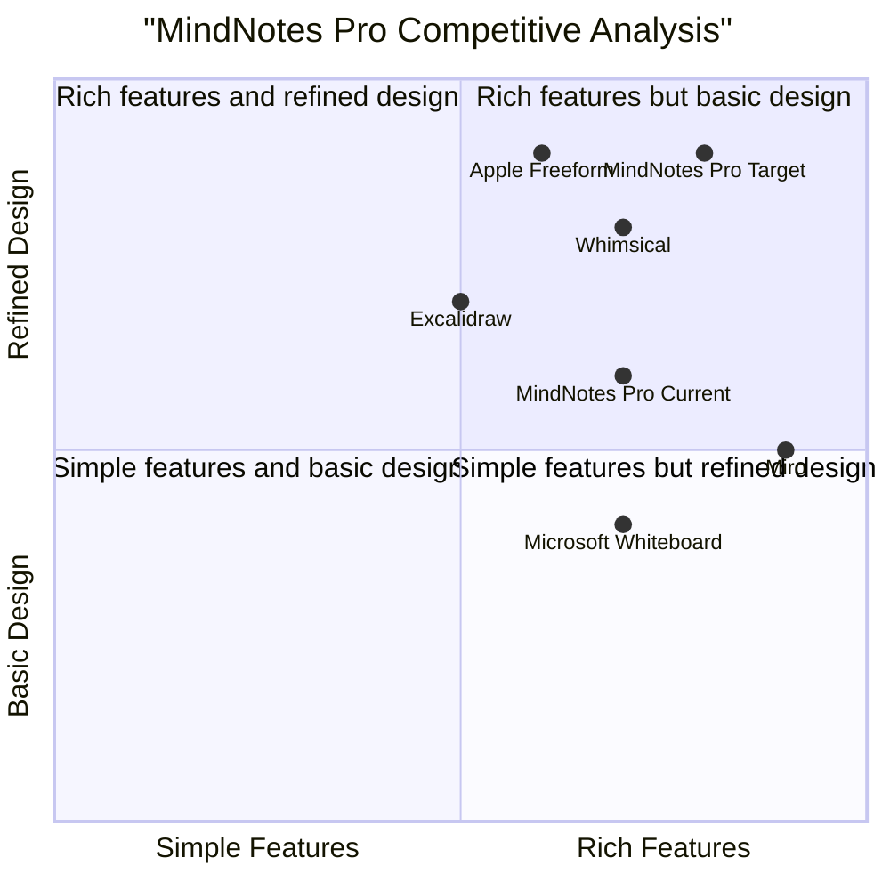
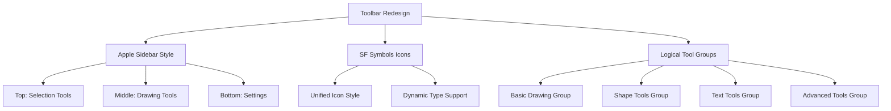

# MindNotes Pro - Apple HIG Compliance PRD

## 1. Language & Project Info

- **Language**: Chinese (中文)
- **Programming Language**: TypeScript + React + Vite
- **Design System**: Tailwind CSS + Apple HIG
- **Project Name**: mindnotes-pro
- **Original Requirement**: Refactor MindNotes Pro to fully comply with Apple Human Interface Guidelines

## 2. Product Definition

### 2.1 Product Goals

1. **Full Apple HIG Compliance**: Ensure UI/UX design completely follows Apple design specifications for native macOS/iOS experience
2. **Seamless Apple Ecosystem Integration**: Deep integration with Apple ecosystem supporting Handoff, iCloud sync, and other native features
3. **Professional Drawing Experience**: Provide smooth, precise whiteboard drawing functionality meeting professional user expectations

### 2.2 User Stories

1. **As a designer**, I want to use tools that follow Apple design specifications so that I can work efficiently in a familiar environment
2. **As an educator**, I need a simple and intuitive interface so that I can quickly create teaching whiteboard content
3. **As a team collaborator**, I want whiteboard content to seamlessly sync across all Apple devices so I can collaborate anytime, anywhere
4. **As a creative professional**, I expect professional drawing tools and precise color control to express complex creative ideas
5. **As a regular user**, I want the app to launch quickly and operate smoothly for instant idea capture during meetings or brainstorming sessions

### 2.3 Competitive Analysis

| Product | Pros | Cons | HIG Compliance |
|---------|------|------|----------------|
| Apple Freeform | Native integration, smooth experience | Relatively simple features | 95% |
| Miro | Powerful collaboration | Complex interface, non-native | 40% |
| Microsoft Whiteboard | Office integration | Design not refined | 50% |
| Excalidraw | Open source, clean | Limited features | 60% |
| Notion Whiteboard | Notes integration | Average performance | 45% |
| Whimsical | Beautiful design | Payment limitations | 70% |

### 2.4 Competitive Quadrant Chart



## 3. Technical Specifications

### 3.1 Requirements Analysis

Based on codebase analysis, the following key Apple HIG compliance issues were identified:

**Critical Issues:**

1. **Color System Non-Compliance**:
   - Current custom colors (`#2c2416`, `#f5f0e8`, etc.) do not follow Apple system colors
   - Dark mode implementation partially complies with Apple HIG
   - Color contrast may not meet WCAG 2.1 AA standards

2. **Typography System Issues**:
   - Uses `Noto Sans SC`, `PingFang SC` - should use SF Pro system font
   - Font sizes and line heights need Apple typography hierarchy
   - Missing Dynamic Type support

3. **Interaction Pattern Deviations**:
   - Gesture handling partially deviates from macOS/iOS native patterns
   - Missing Apple haptic feedback integration
   - Keyboard shortcuts need Apple standard mapping

4. **Component Design Gaps**:
   - Toolbar and sidebar design needs Apple sidebar specification
   - Buttons, pickers need Apple design language
   - Missing standard Apple animations and transitions

### 3.2 Requirements Pool

| Priority | Requirement | Difficulty | Impact |
|----------|-------------|------------|--------|
| P0 | Implement Apple system color palette | Medium | Global |
| P0 | Adopt SF Pro font and Apple typography | Low | Global |
| P0 | Refactor toolbar/sidebar to Apple HIG | High | Core UI |
| P1 | Implement standard Apple gestures | High | Canvas |
| P1 | Add Dynamic Type support | Medium | Text |
| P1 | Implement Apple standard animations | Medium | UI |
| P2 | Integrate iCloud sync | High | Storage |
| P2 | Support Handoff continuity | Medium | Multi-device |
| P2 | Implement Apple Pencil pressure | High | Drawing |

### 3.3 UI Design Draft

#### 3.3.1 Apple Color System Implementation

**Current Issues Found:**
```
// canvasDrawing.ts - Line ~180
ctx.fillStyle = 'rgba(155,142,127,${alpha})' // Custom gray, not Apple standard

// canvasDrawing.ts - Line ~120
ctx.strokeStyle = el.color; // Direct color usage without Apple color system
```

**Proposed Apple Color System:**

| Role | Light Mode | Dark Mode | Apple Name |
|------|------------|-----------|------------|
| Primary | #007AFF | #0A84FF | systemBlue |
| Secondary | #5856D6 | #5E5CE6 | systemPurple |
| Accent | #FF9500 | #FF9F0A | systemOrange |
| Background | #FFFFFF | #000000 | systemBackground |
| Text Primary | #1C1C1E | #FFFFFF | label |
| Text Secondary | #3C3C43 | #EBEBF5 | secondaryLabel |

#### 3.3.2 Toolbar Redesign

**Current Problems:**
- Non-standard toolbar layout
- Inconsistent button styles
- Tool grouping not following Apple HIG

**Proposed Solution:**


#### 3.3.3 Canvas Interaction Improvements

**Current Issues:**
- Gesture handling partially non-compliant with Apple patterns
- Missing haptic feedback
- Non-standard keyboard shortcuts

**Proposed Changes:**

1. **Gesture Support:**
   - Pinch to zoom (standard)
   - Two-finger rotate (where applicable)
   - Three-finger pan (canvas navigation)

2. **Haptic Feedback Integration:**
   - Use `UIImpactFeedbackGenerator` for iOS
   - Use `NSHapticFeedbackManager` for macOS
   - Feedback on tool selection, object snap, etc.

3. **Keyboard Shortcut Mapping:**
   | Function | Current | Apple Standard |
   |----------|---------|----------------|
   | Undo | Ctrl+Z | Cmd+Z |
   | Redo | Ctrl+Shift+Z | Cmd+Shift+Z |
   | Copy | Ctrl+C | Cmd+C |
   | Paste | Ctrl+V | Cmd+V |
   | Select All | Ctrl+A | Cmd+A |

### 3.4 Open Questions

1. **Performance Optimization**: How to optimize large canvas rendering while maintaining Apple HIG compliance?
2. **Accessibility**: How to implement complete VoiceOver support and Dynamic Type adaptation?
3. **Cross-Platform Consistency**: How to maintain consistent experience between macOS and iOS while adapting to each platform?
4. **Data Migration**: How to seamlessly migrate existing user data to new Apple HIG compliant interface?

## 4. Apple HIG Compliance Checklist

### 4.1 Design Principles Application

1. **Clarity**:
   - [ ] Use clear, legible fonts (SF Pro)
   - [ ] Ensure sufficient contrast ratios
   - [ ] Avoid visual clutter

2. **Deference**:
   - [ ] Content is the primary focus
   - [ ] UI supports but doesn't compete with content
   - [ ] Use translucency and blur effects appropriately

3. **Depth**:
   - [ ] Visual hierarchy through layers
   - [ ] Meaningful animations
   - [ ] Immediate feedback on interactions

### 4.2 Specific Compliance Items

#### 4.2.1 Color Compliance
- [ ] Use Apple system colors or approved extensions
- [ ] Support dynamic colors (Light/Dark mode)
- [ ] Ensure 4.5:1 contrast ratio (text against background)
- [ ] Provide alternatives for color-blind users

#### 4.2.2 Typography Compliance
- [ ] Use SF Pro font family
- [ ] Support Dynamic Type scaling
- [ ] Follow Apple typography hierarchy:
   - Large Title: 34pt
   - Title 1: 28pt
   - Title 2: 22pt
   - Title 3: 20pt
   - Headline: 17pt (Bold)
   - Body: 17pt
   - Callout: 16pt
   - Subhead: 15pt
   - Footnote: 13pt
   - Caption 1: 12pt
   - Caption 2: 11pt

#### 4.2.3 Layout Compliance
- [ ] Use standard margins and spacing (16pt margins)
- [ ] Adapt to different screen sizes
- [ ] Support Split View multitasking
- [ ] Follow safe area guidelines

#### 4.2.4 Interaction Compliance
- [ ] Support standard gestures
- [ ] Provide haptic feedback where appropriate
- [ ] Implement expected animations (300ms standard duration)
- [ ] Support keyboard navigation and focus management

## 5. Implementation Roadmap

### Phase 1: Foundation (1-2 weeks)
1. Refactor color system to Apple system colors
2. Implement SF Pro font and Dynamic Type
3. Basic UI component refactoring (buttons, inputs, etc.)

### Phase 2: Core UI Refactoring (2-3 weeks)
1. Complete toolbar and sidebar refactoring
2. Canvas interaction improvements
3. Implement standard animations and transitions

### Phase 3: Advanced Features (3-4 weeks)
1. iCloud sync integration
2. Handoff support
3. Apple Pencil advanced features
4. Complete VoiceOver support

### Phase 4: Optimization & Testing (1-2 weeks)
1. Performance optimization
2. Comprehensive accessibility testing
3. User testing and feedback collection

## 6. Success Metrics

| Metric | Target | Measurement |
|--------|--------|-------------|
| Design Consistency | 100% Apple HIG compliance | Design audit |
| Performance | 60fps rendering, <1s startup | Performance profiling |
| User Satisfaction | ≥4.5 star rating | App Store rating |
| Accessibility | WCAG 2.1 AA compliance | Accessibility audit |
| Platform Integration | Full Handoff/iCloud support | Feature testing |

## 7. Appendix: Code Analysis Summary

### 7.1 Files Requiring Major Changes

1. **src/canvas/canvasDrawing.ts**
   - Replace custom colors with Apple system colors
   - Update font references to SF Pro

2. **src/components/toolbar/*.tsx**
   - Complete redesign to Apple sidebar spec
   - Use SF Symbols for icons

3. **src/components/Sidebar.tsx**
   - Implement Apple sidebar pattern
   - Add proper navigation hierarchy

4. **src/store/useThemeStore.ts**
   - Implement proper Apple color system
   - Support appearance changes via system settings

5. **tailwind.config.js**
   - Add Apple color tokens
   - Configure Apple typography scale

### 7.2 New Files Needed

1. **src/theme/appleColors.ts** - Apple system color definitions
2. **src/theme/appleTypography.ts** - Apple typography system
3. **src/components/common/AppleButton.tsx** - Apple-styled button component
4. **src/components/common/AppleSidebar.tsx** - Apple sidebar component

---

*Document Created: 2026-06-09*
*Based on MindNotes Pro v3.3 Codebase Analysis*
*Apple HIG Version: June 2026*